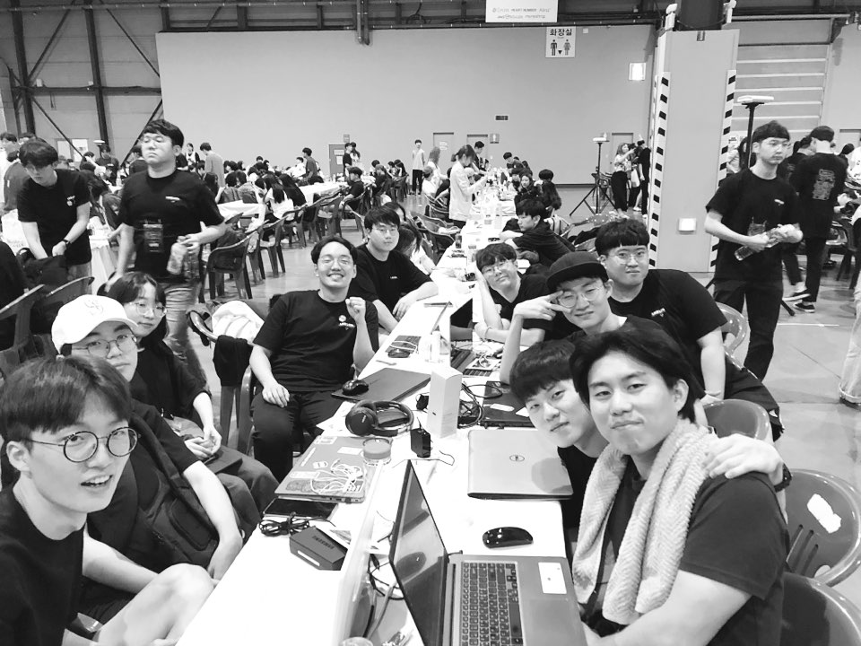
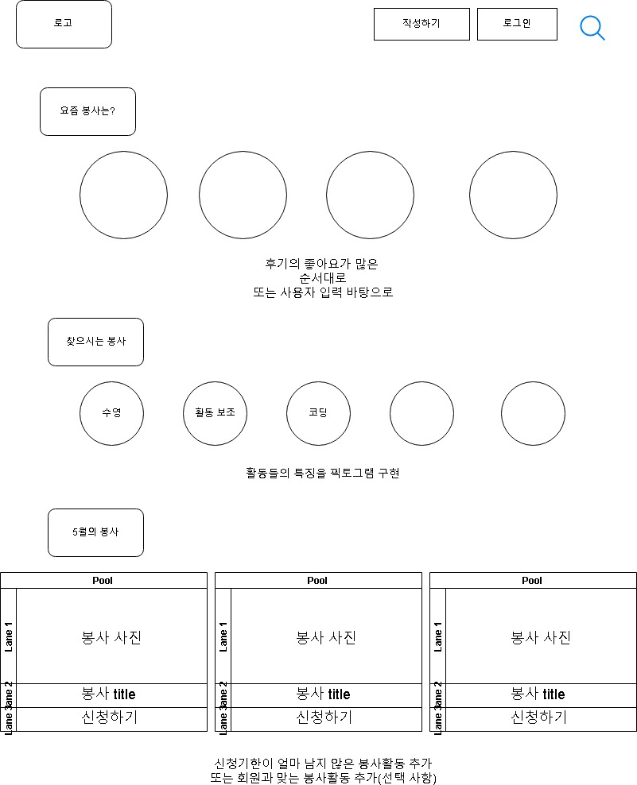
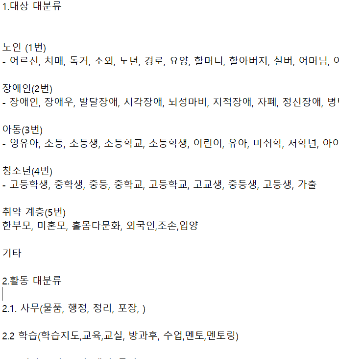
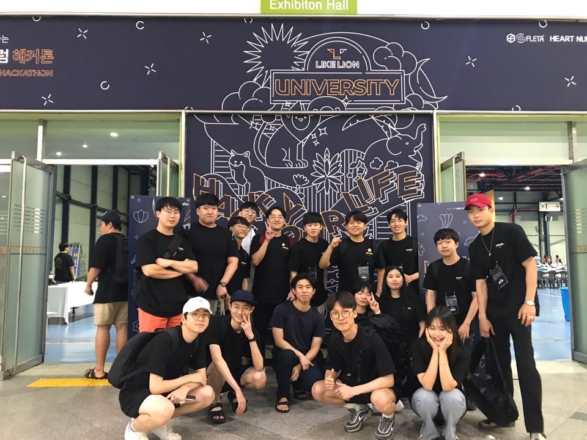

멋쟁이 사자처럼을 하며 13명의 팀원을 한달 동안 고생하게 만든 프로젝트 봉투였다.

사실 이 플랫폼은 내가 처음 기획한 것이라, 고생 꽤나 했다(팀원들도 마찬가지)

이번 기획 일기는 조금 일대기적으로 기록해보려고 한다. 기획 한 지 6개월이 지난 지금, 기억이 선명하기 보다는 띄엄띄엄 기억나서

~~니가 아주 나를 띄엄띄엄 보는구만~~

각설하고, 본격적인 얘기를 해보고자 한다. 봉투 어떻게 기획 되었는지 보자.

---

### 5월: 아이디어 기획 및 팀 빌딩 단계

문제점은 명확했다. 친한 사회복지사들 만나면, 항상 그런 얘기를 해왔다.

봉사활동 하는 사람도 별로 없고, 온다 하더라도 잘 안 맞는것 같아.

사회복지사가 봉사활동 하는 사람을 구별해서 받지는 않는다. 하지만 이들도 사람이라 기대는 한다. 하다보니 여러가지 어려움을 겪는다. 예를 들어 봉사활동 하러 왔으면서 도움이 되기는 커녕 민폐가 되는 사람들이 있으니까.

그래서 이 문제를 해결하고자 처음에 생각한 것이 봉사활동 구인 구직 플랫폼이었다. 봉사활동을 구하는데 있어 채널이 한정적이고, 그 채널을 다양화 하는 것이 필요하다 생각했다. (사실 이 아이디어 말고 다른 아이디어가 많았지만, 하나는 법적인 이유로, 하나는 기술 스택의 한계로 실패했다)

가지고 있는 동아리에서 아이디어 발표 하고 팀원을 모아 13명의 팀원이 구성 되었다. 

봉사활동 구인, 구직 플랫폼을 하고자 했을 때 , 팀원 중에 한 명이 나에게 질문을 던졌다.

13명의 팀원 이렇게 해서 결성이 되었다.

종현아 나 같으면 구인, 구직 플랫폼 안 쓸거 같아. 그냥 봉사활동 후기를 남기는 건 어때?

괜찮은 아이디어였다. 인스타그램 봉사활동 버젼으로 해보자였다.  감성적인 컨셉으로 봉사활동에 후기를 남기고 그것에 대해 공유를 하면 사람들도 봉사활동에 동기부여를 줄 수 있다는 것이었다.

그렇게 해서 봉사활동 후기 플랫폼으로 처음 시작을 했다.

### 6월: 기말고사 이후

사실 기말고사를 보고 나서 심신이 지쳐, PM 자리를 포기하려고 했다. 하지만 그래도 내가 기획한 아이디어니 포기하지 말자고 해 시작을 했다.

---

팀원들 구현 능력부터 판단해야 했다. 6월 30일, 전북대 앞 인앤아웃에서 모여 다 같이 밤샘코딩을 해보자 했다. 멋사 강의 장고는 무조건 다 듣고 와서 구현해 보는 것이 숙제였다.

결과는 생각보다 참담했다. 개발 팀장이 직접 만든 인스타그램 클론 코딩 서류가 있었는데 나 포함해서 어느 누구도 다 따라하지를 못했다. 

그래서 생각이 들었다. 장고로는 모든 팀원들 서버 개발을 시키지말자 였다. 그래서 방학 동안 서울에 있는 사람들은 장고로 서버 개발을 하고, 나머지 전주에 있는 팀은 HTML과 CSS로 틀을 만들어 주기로 했다.

이렇게 해서 서울 팀은 서버 개발 나 포함해서 5명 나머지는 전주 팀 6명은 템플릿 및 기본 틀 작성 2명은 디자이너로 프로젝트를 시작했다.

### 7월 1주: 본격적 작업 시작

해커톤이 본격적으로 8월 9일로 잡혔다. 어떻게든 8월 9일날 해커톤에서 롤토체스를 하자는 것이 개발자들 목표였고 나 또한 역시 그러했다. 내 목표는 나머지 오류를 해커톤에서 잡자는 것이었다.~~(개발자랑 기획자랑 이렇게 다릅니다)~~

서버 개발 팀은 첫 번째 목표는 분명했다. 일단 사이트에 쓰일 데이터 부터 가지고 오자는 것이었다. 기존에 존재하는 봉사활동 플랫폼(VMS,1365) 사이트들의 데이터를 크롤링 해왔다.

디자인 팀은 난감했다. 처음 기획을 하는 기획자다 보니 사이트 컨셉이 명확하지를 않았고, 나 역시 이렇게 기획을 했으니 만들어주세요 하면 다 끝나는 줄 알았다. ~~(웹 기획 책 좀 읽어보지...)~~

그래서 개발 팀장이 합의점을 찾은 것이 화면설계도를 너가 구성하고 싶은 데로 작성해 보라는 것이었다. 결과는 많은 혼란을 나았다.

디자이너들에게 처음으로 보내준 wireframe

디자이너들한테 첫 번째로 보내주었던 도면이다.  

디자이너들이 많이 헷갈렸던 것은 

- 버튼을 누르면 대체 어느 페이지로 가는가?
- 버튼과 각 상세 기능은 무엇이며 그리고 왜 이 기능을 넣었는가?
- 필수 페이지에 맞는 전체적인 흐름과 기능 분화가 제대로 나왔는가?
- **어떤 기능을 하고 어떤 버튼인가?**

지금 생각해보면 요구사항이 명확하지 않았고 컨셉이 명확하지 않았기에 전체적인 디자인을 하기가 어려웠을 것이다 

그 때는 Balsamiq 같은 화면 설계 도구도 사용하지를 못했으니 깔끔하게 보이지도 않았을 것이다. 

그래서 디자이너와 개발팀장 그리고 기획자인 내가 속앓이를 많이 했다. 

결국, 개발 팀장과 디자이너들이 내 의도만 파악한 체로 디자인을 들어갔다. 지금 생각해 보면 너무 미안하다. 그리고 의도 전달에 비해 그리고 디자인이 너무 깔끔하게 나와서 더 고맙고 미안했다. 

### 7월 2주: 명확한 디자인 결과물, 전주 팀 작업 시작

디자인이 완성 되었으니, 기반 틀이 될 HTML 페이지와 CSS 페이지를 구성하는 전주 팀이 일을 시작할 수 있게 되었다. 첫 주 간단하게 워밍업으로 sign up 페이지 부터 작업 시작하자 했다. 당시 전주 팀장도 동의를 했고 3일 내로 완성해 달라고 했다.

서버 개발 팀은 데이터 크롤링을 하는데 애를 많이 먹었다. VMS는 pk 값이 정렬이 잘 되어 있었지만 ,1365는 pk값 정렬이 제대로 안되어 있던 점, 분류 항목부터 해서 모든 단어들이 일반인들이 알아 듣기 어려운 점, 이러한 데이터를 전부 재정렬 했어야 했고, 빈도수 높은 5가지만 뽑자는 의견도 나오고 정신 없었다. 어떻게 하나 , 다 합리적이니 다 하자 했다.

나는 백엔드 팀으로 들어가 서버 구현을 시작했다. 크롤링은 되었으니 , 내가 할 것은 시각화였다.

대상 대분류, 활동 대분류가 필요했기 때문이다.

pandas를 통한 시각화 하자 했다. 크롤링한 데이터들 분류해 시각화를 해봤다. 의미 없는 단어들 다 정리하고 처리하고 사회복지사 만나 보아서 합의를 거쳐 보았다.

그렇게 해서 완성된 데이터들이다.

데이터 리스트

정말 이런 말 하면 이상해 보일 수도 있지만 정말 '개고생' 해 가며 데이터를 구성해 나갔다. 왜 데이터에 그렇게 대기업들이 목숨 거는지도 알았고 , 데이터 중요성도 여기서 많이 깨달았다.  행아웃으로 4명이 이틀 동안 분류 짜가면서 진행했다. 데이터는 분류 되었으니 이제 코드 짤 시간이 되었다. 템플릿이 로그인 부터 나왔으니,  로그인 부터 서버 개발 시작하자고 했다. 지금 생각해 보면 여기도 힘들었다. 구글에 "장고 로그인 개발" ,"Django login" 이런식으로 레퍼런스 다 찾아가면서 장고 로그인을 개발했고 FBV 방식으로 form 써가며 로그인 개발 했으니 삽질을 어마어마하게 했었다. 

이렇게 매일 새벽 3시까지 작업했었다.

### 7월 3주:  응? 처음부터 다시 하자고?:MODEL부터 다시 설계

잘 굴러가는 듯 했다. 우려했던 전주 팀은 서로 민폐를 끼치지 말자는 모토 하에 열심히 했다. 데드라인에서 하루 이틀 연장하는 정도였지 착실하게 코딩을 잘 해주었다. 서버 설계도 기능별로 구현이 잘 진행되었다. 그런데 진행 되던 중 서울 팀원 한 명이 나에게 물었다.

종현아 이렇게 기능별로 구현하는 것이 맞나? 나는 좀 이상해 보이는데??

문제 없다 생각했다. 각 기능별로 구현한 다음 마지막에 합치면 끝나겠지 않겠는가? 이런 생각으로 계속 진행해 왔다. 구현 하던 중 개발 팀장이 전주에서 올라왔다. 와서 작업 시작하려고 했는데 허허 웃음만 지었다. 이유는 이랬다.

종현아. 모델도 안 짜고 작업 시작하면 어떻게 하려고 하니? 하하 더군다나 니네 코드 공유를 무슨 카톡으로 해? Github는 쌈 싸먹었니?~~(올드하다)~~

아뿔싸! 전체 구조도 설계하지 않은 체로 기능 구현을 해 나갔으니, 밑그림도 없이 채색하는 꼴이었다. 그래서 모델 부터 다시 짜고 작업 들어갔다.

자세한 모델 설계는 Github 페이지로 들어가시면 보인다.

[bongtoo/bongtoo_restapi](https://github.com/bongtoo/bongtoo_restapi)

코드 공유도 깃헙으로 바꾸어 각자 원격저장소에서 작업해 나갔다.

### 7월 4주: 다시 시작하자!

로그인은 어느 정도 구현이 되었다.  무엇이 문제가 되냐고 물어보니 바로 검색이었다. 검색 기능을 구현하려고 하니 몇 가지 문제가 있었다.

나는 키워드 단어로만 검색 기능이 구현되어야 한다고 주장했다. 사용자들이 사이트 들어와서 키워드를 직접 찍어가며 구현하는 것은 말이 되지 않는다고 생각했다.

개발자들은 생각이 조금 달랐다. 미리 작업해 놓은 활동 대분류 안에 모든 활동이 들어갈 수 있도록 구성을 해 시간을 단축 시키자는 것이었다.

해커톤이 2주 밖에 남지를 않았고 검색 하나에 매달리기에는 시간이 너무 부족했다. 오케이! 있는 분류가 모든 활동을  포함할 수 있는지  판단하기 위해 비교부터 해야했다.

VMS,1365가 있었으니 거기에 나온 것과 비교하자 생각했다.

문제가 하나 있었다.

**분류가 무슨 말인지 모르겠다.** 

지금 들어가 봐도 무슨 말인지 감이 잘 잡히지를 않는다. 금,물품 봉사 그 때는 이미용 봉사라는 것이 무엇인지도 몰랐으니까. 사회 봉사를 오랫동안 하신 분들이라면 저 이름들의 의미를 알겠지만, 나 같은 경우 무슨 말인지 이해가 되지를 않았다.

정말 다 주는 산타는 없었다.

그래서 위에 활동 대분류 안에 세분화라는 말이 나온다. 그나마 기존의 활동 대분류 보다 좀 더 직관적으로 알아들을 수 있도록 분류하자고 했고~~(사실 이것도 그렇게 직관적이지는 못하다)~~ 최대한 모든 봉사활동이 분류 안에 포함 될 수 있도록 신경 썼다.

사회복지사 분이랑 협의 끝에 6가지 대분류로 마무리 하였다.  

프론트 틀도 어느 정도 가닥이  잡혔다. 마지막 어려운 홈페이지를 작업을 남겨 놓았고 어느 정도 사이트 윤곽이 보이는 듯 했다.

### 8월 1주: 해커톤 가기 전 마지막!

지금 생각해 보면 팀원들에게, 아이템에게 미안한 주가 바로 저 주차이다. 나도 어느 정도 사이트 윤곽이 보인다 판단 했고, 내가 더 이상 할 것이 없다 판단했다. 백엔드와 프론트엔드는 개발 팀장이 마지막으로 drf로 정리한다고 얘기했고, PM인 나는 알바 친구들이랑 재밌게 노느라 3,4 일 정도 프로젝트에 신경을 쓰지 않았다. 내 최대 실수다. **PM의 역할은 프로젝트가 끝날 때 까지 끝난 것이 아니다.** 계속 체크해주고 조율해주어야 하는 입장이다.

~~신나게 놀다가~~ 해커톤 3일 전 부터 다시 체크 들어갔다. 결과는 예상과 많이 달랐다. 개발팀장이 혼자 열심히 코딩했는데 생각보다 회원 인증 부분이 제대로 돌아가지를 않나 보다. 그것도 그렇고 홈페이지 부분을 다시 작업해야 한단다. 내가 보더라도 디자인과 많이 달랐다. 어쩔수 없었다. 배포 문제도 있었고 개발 팀장도 drf로 사이트 짜보는 것은 처음이란다. 

어쩔 수 없었다. API는 필요한데 drf 하나 만으로 매달리기에는 도박이었다. 나를 포함해 서울팀 한명이서 개발 팀장네에 2박 3일 숙박을 해 가면서 나랑 서울 팀원은 GraphQL, 개발팀장은 하던 drf를 그대로 구현해 나갔다.

GraphQL을 배워나가면서 구현하자니 나에게는 벅찼다. 결국 해커톤은 개발팀장 몫으로 온전히 돌아갔다.

### 8월 9일: 멋쟁이 사자처럼 7기 해커톤

전북대학교 해커톤 단체 사진~~(다들 개발자스럽다)~~

해커톤이 찾아왔다. 롤토체스를 하겠다던 개발자들의 꿈은 사라졌다. 사이트 배포하려고 하니 에러 뜨고, 검색 기능도 구현이 되지를 않았다. 어떻게 하나 계속해서 해야지. 새벽 4시가 가까이 되도록 사이트는 구현이 되지를 않았고, 로그인까지 다시 말썽이었다.  나 역시 아이디어 사이퍼를 위해(1분 동안 자기 아이디어 발표) 전주 팀과 발표 대본 짜느라 구현은 뒷전이었고, 남은 개발은 서울팀이 아침까지 밤을 새가며 최선을 다했지만, 결국에는 26표의 최종 득표를 얻은 체 봉투는 배포되지 못하고 해커톤에서 마무리 되었다. 

---

엄연히 기획을 중심으로 글을 썼고, 기억나는 장면들만 썼다. 중간중간 기억이 나면 고쳐나가겠다.

첫 번째 기획 아이템이었던 봉투는 결국 사업화로 이어지지 않았다. 다른 것 보다 **고객 니즈에 충족하지 못했던 아이템**이었기 때문이다. 봉사활동 참여율도 많이 떨어지는 이유는 시간과 관심이 부족한 것이지, 봉사활동 찾기가 어려워서가 아니니까. 이를 통해 한 가지 알 수 있었다. 소프트웨어 사업은 고객의 니즈를 정확히 파악하고, 서비스를 사용함으로써 부가혜택이 있어야 만이 사람들이 사용한다는 것이다.  큰 깨달음을 준 첫 번째 기획 사이트, 봉투 였다.